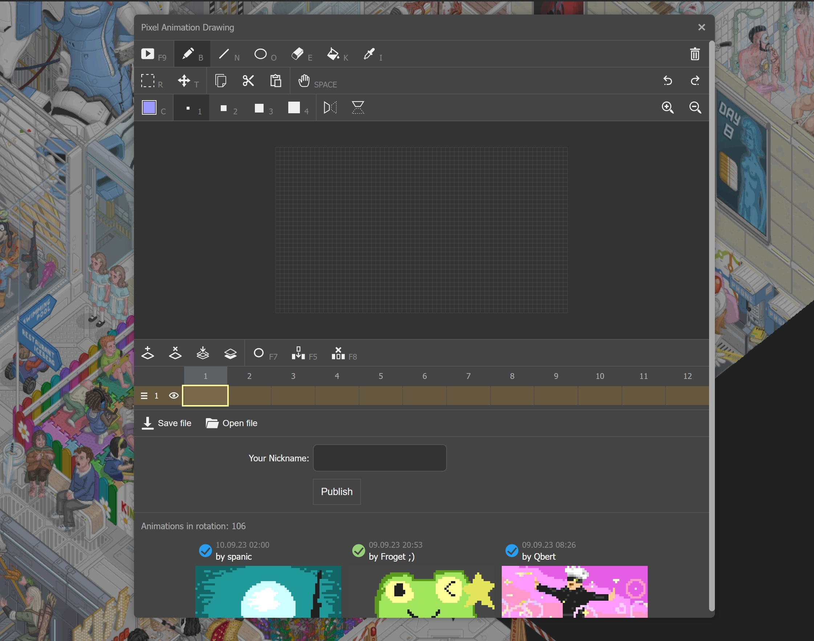

# Mini Pixel Animation Editor

This is a small editor for creating looped pixelated animations for 
the [Fun Drawing screen](https://floor796.com/#t0r2,687,140) in the [floor796.com](https://floor796.com) project. 

You can play with editor right in the project or on this [Demo page](https://horpia.github.io/floor796-fun-drawing/dist/).



## Install & Run

```
npm i
npm run serve
```

## Contributing

This repository is open to any contribution to improve or fix bugs in this editor.